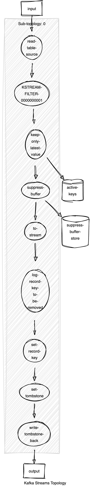

# Rationale

## Design

The Tombstone service is implemented as a Kafka Streams application to consume `KTable`'s source topics and capture keys and timestamps.

Current Kafka Streams topology:

```text
Topologies:
   Sub-topology: 0
    Source: read-table-source (topics: [QUERYABLE_T1])
      --> KSTREAM-FILTER-0000000001
    Processor: KSTREAM-FILTER-0000000001 (stores: [])
      --> keep-only-latest-value
      <-- read-table-source
    Processor: keep-only-latest-value (stores: [active-keys])
      --> suppress-buffer
      <-- KSTREAM-FILTER-0000000001
    Processor: suppress-buffer (stores: [suppress-buffer-store])
      --> to-stream
      <-- keep-only-latest-value
    Processor: to-stream (stores: [])
      --> log-record-key-to-be-removed
      <-- suppress-buffer
    Processor: log-record-key-to-be-removed (stores: [])
      --> set-record-key
      <-- to-stream
    Processor: set-record-key (stores: [])
      --> set-tombstone
      <-- log-record-key-to-be-removed
    Processor: set-tombstone (stores: [])
      --> write-tombstone-back
      <-- set-record-key
    Sink: write-tombstone-back (topic: QUERYABLE_T1)
      <-- set-tombstone
```

Where `QUERYABLE_T1` is the source topic name.



Session window is used to keep the latest record per key in an open window.
A `suppress` operator is right-after the aggregation to buffer changes until window is closed.
Once window is closed, meaning a key has stop receiving changes during the inactivity gap period, then a tombstone is prepared to be sent to the input table topic.

### Costs

Having this application deployed, means:

- Adding a Consumer of the KTable source topic, duplicating the consumption of events from the topic.
- A persisting session store at the Kafka Streams instance. This will require storage relative to the key cardinality x (key size + empty array).
- An in-memory suppress store is also created to buffer session store changes.
- Both stores require changelog topics.
- Tombstone message will increase the source topic size.
